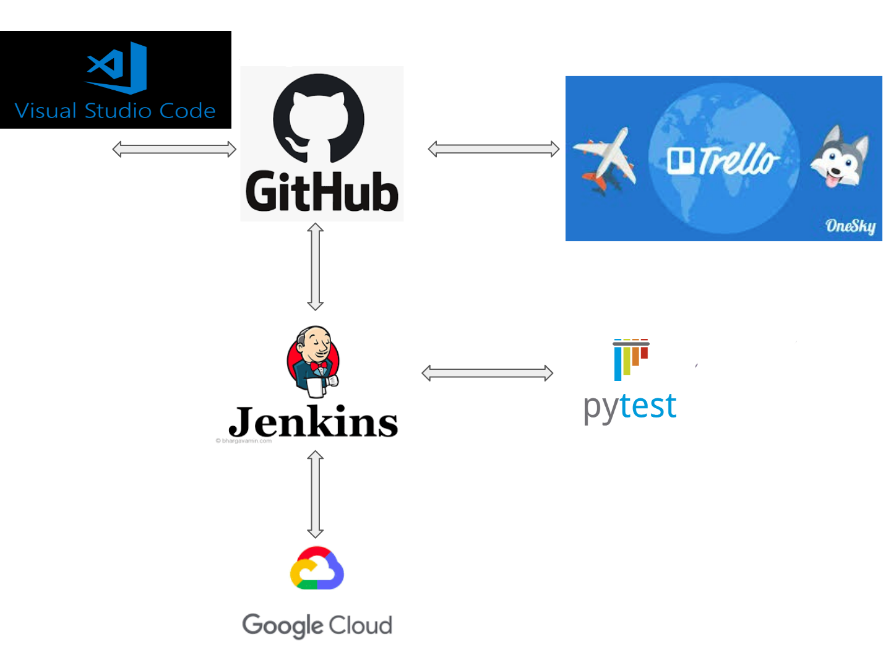

# QAProject1

[My ideal ERD representation](https://drive.google.com/file/d/1-ukFDbqeWsIfEVCPUWOmNFj9W95Ktbze/view?usp=sharing)
 
 
The ERD linked above shows the desirable final entity relationship diagram. Implementation did not reach inclusion of Class or Race rulesets.
 
 
[Trello board of agile development process](https://trello.com/b/P9M2NvAt)
 
 
The Kanban style trello board above lists the decided user stories for the project and the sprints in which they were implemented as well as future features that were not reached. While it was not noted these were decided using the MoSCoW method.
 
 
[A brief risk assessment](https://1drv.ms/w/s!AhSuBRLI6vRYsWXDDgt6qmgNjH57?e=LUZDzE)
 
 
The table linked above gives a brief summary of threats to user information, preservation of data and intergrity of data.

## Deployment

 
 
Testing: 
Test cases need to be created for: 
Page redirect on submission  
Page redirect on page redirect when not logged in accessing pages requiring it 
Submission of data 
Display of data 
